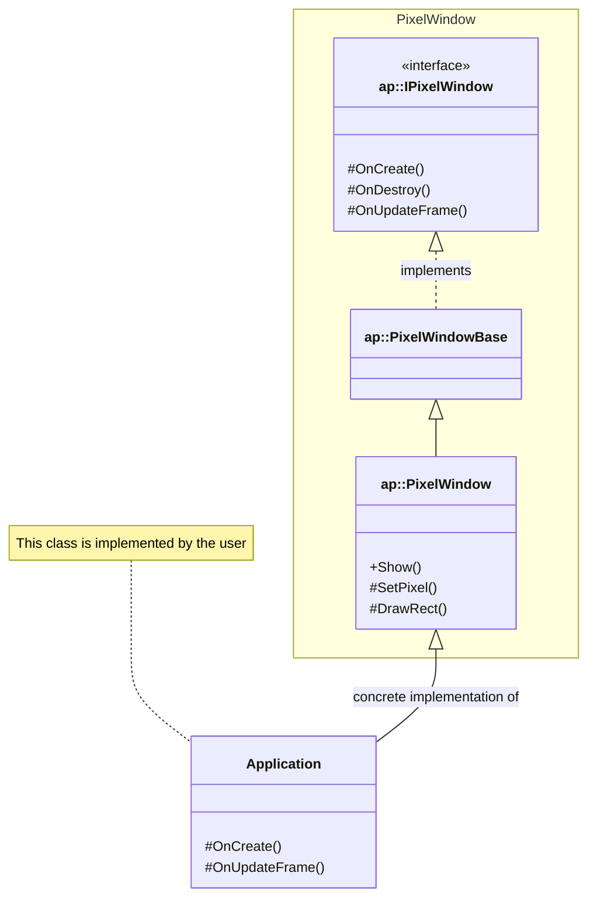

# PixelWindow Project

## Introduction
A PixelWindow is a simple, callback-based abstraction for a window on the Windows operating system. The abstraction enables the simple creation of a window simply by extending the PixelWindow class, hiding platform-specific details and complexities. The PixelWindow abstraction is deliberately designed to be a simple (CPU-based) way of creating a window and is not intended to be a UI framework.

As well as creating a window, the PixelWindow creates an internal canvas, which can be updated using its pixel drawing methods. The canvas size can be set independently to the window and then scaled when presenting.

The current implementation of the PixelWindow requires C++17.

## Usage
The PixelWindow class is an abstract class which must be extended in order to be used. It provides a number of callback interfaces, which are called during various points in the window's lifetime. In order to create a window, simply include the "pixelwindow/window.h" header file and extend the `ap::PixelWindow` class, optionally implementing its callback interfaces:
```c++
#include "pixelwindow/window.h"

class Application : public ap::PixelWindow
{
protected:
    void OnCreate(unsigned width, unsigned height) override
    {
        // Creation logic
        // Called just after the window was created
    }

    void OnDestroy() override
    {
        // Destruction logic
        // Called just before the window was destroyed
    }

    bool OnUpdateFrame(double millis) override
    {
        // Frame update logic
        // Called once per iteration of the main loop
        return false;
    }
};
```

The window will be displayed on screen when calling the `ap::PixelWindow::Show` (blocking) method. The window width and height (in pixels), as well as the window title, can be set during a call to this function:
```c++
int main()
{
    Application app;
    app.Show(600, 400, "My Window"); // this creates the window
    return 0;
}
```

In order to set the colour of a pixel in the canvas, you must call the `ap::PixelWindow::SetPixel` method, passing a destination coordinate and a `Pixel` colour value. For example:
```c++
bool OnUpdateFrame(double millis) override
{
    ClearCanvas();
    SetPixel(100, 100, Pixel(255, 0, 0, 255)); // red

    // Return true to present the canvas
    return true;
}
```

Note that the `ap::PixelWindow::ClearCanvas` method shown in the above example will set all pixels of the canvas to a given colour, or NONE if no argument is given (NONE is equal to Pixel(0,0,0,0)). The `ap::Pixel` union represents a Pixel with red, green, blue, and alpha channels. It is internally represented as BGRA to match the underlying window surface. It contains four bytes packed into a 32-bit value, where on a little-endian system, the LSB contains the blue channel and the MSB contains the alpha channel:
```c++
// Stored in memory as: [ BB GG RR AA ]
union Pixel {
    uint32_t raw = 0;
    struct { uint8_t b, g, r, a; } bgra;
};
```

Although the `raw` and `bgra` members can be set directly, it is recommended to use the `ap::Pixel` union's constructor:
```c++
constexpr Pixel(uint8_t r, uint8_t g, uint8_t b, uint8_t a);
```

Please note that the PixelWindow does not perform alpha-blending. Instead, the alpha component of a Pixel is treated as a boolean write mask where if its value is non-zero, the canvas will be updated with the entire 32-bit value. If, however, the alpha component is zero, the canvas will not be updated. This mask does not apply to the `ClearCanvas` function, where the canvas is set to the Pixel's value (regardless of the alpha value).

For a working example, which draws a square in the centre of the window, please see the "basic" demo project in the "demos" directory. In addition to the `OnCreate`, `OnDestroy`, and `OnUpdateFrame` interfaces, the `ap::PixelWindow` class provides the following protected callback methods that can be overridden:

| Callback Name | Description |
| --- | --- |
| OnCreate | Called just after the window was created but before it is displayed. The window width and height are passed to the callback. |
| OnDestroy | Called just before the window is destroyed. Use this to free resources created in `OnCreate`. |
| OnFocusChanged | Called when the window is brought to the foreground or sent into the background. The focus state (`true`: has focus, `false`: lost focus) is passed to the callback. |
| OnDropFile | Called when a user drops a file onto the window. The path of the file (as a `std::string`) is passed to the callback. |
| OnUpdateFrame | Regularly called in the window's message loop. By default, this will be called as fast as possible (unless an "update interval" has been set) and should be used to update the window's canvas using the PixelWindow's pixel drawing methods. The time (in milliseconds) since the last update is passed to the callback. Returning `true` from this method will result in presenting the canvas to the window. |
| OnKeyPress | Called when there is a key event on the window. The `Key` key and the "down" state (`true`: key-down, `false`: key-up) is passed to the callback. |
| OnMouseClick | Called when there is a mouse click event on the window. The `Mouse` button, window coordinate, and the "down" state (`true`: button-down, `false`: button-up) is passed to the callback. |
| OnResize | Called when there is a resize event on the window. The new window width and height are passed to the callback. |

Although callbacks are called synchronously in the main event loop, the PixelWindow makes no attempt at thread synchronisation. If multithreading is desired, synchronisation should be handled by the application itself.

The PixelWindow provides a number of additional public and protected methods, which can be used by a derived class to update the contents of the PixelWindow's internal canvas and state. Please see "pixelwindow/window.h" for more details on these functions.

## High-Level Design
For reference, the following diagram shows how the classes are related for the "basic" demo:

The `Application` class is implemented by the user of the PixelWindow module.

## Building the Demos
The demo applications use CMake to generate their project build files. In order to generate a project, the following command can be used:
```bash
cmake -B build .
```

The demos can then be built using the following command:
```bash
cmake --build build
```

For more information on the build requirements, please see the CMakeLists.txt files for each demo project.

## Releases and Issues
Releases:
* `v0.1` - Initial release supporting Windows and the basic demo project

## Final Remarks
The PixelWindow project is deliberately simple - it was originally created for the sonicx Mega Drive emulator as a way of presenting to the screen. Because of this, the implementation is limited to the minimum functionality required for the sonicx emulator. The code is released under an MIT licence, so do what you want with it :D
